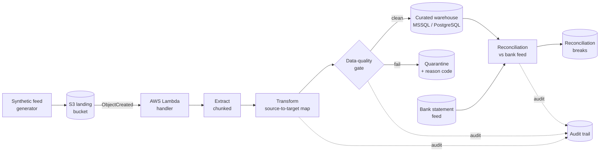

# Financial Data Pipeline — ETL & Reconciliation Engine

A production-shaped ETL and reconciliation engine for a regulated Financial
Services context. It ingests a high-volume transaction feed, maps it onto a
curated warehouse schema, enforces data-quality controls, keeps a full audit
trail, and reconciles the resulting ledger against an external bank
statement — surfacing every break with a reason code.

Built to run on **10M+ daily transaction records** with a flat memory
footprint via chunked processing, and packaged so the same code runs on a
laptop, in CI, or behind an **AWS Lambda** triggered by **S3** landings.

[](https://github.com/OWNER/financial-etl-reconciliation/actions/workflows/ci.yml)

## Why it exists

Financial data feeds are messy and the cost of loading bad data is high. This
project demonstrates the controls that make an ETL process defensible:
explicit source-to-target mapping, a data-quality gate that quarantines
rather than drops, an append-only audit trail keyed by run id, and a
reconciliation step that proves the warehouse agrees with the bank.

## Architecture



## Stack

Python · pandas · SQLAlchemy · SQL (MSSQL & PostgreSQL) · AWS Lambda · S3 ·
GitHub Actions · PyTest. AWS is stubbed locally with `moto`, so the whole
thing runs with **no cloud account required**.

## Quickstart

```bash
python -m venv .venv && source .venv/bin/activate
pip install -r requirements.txt

# 1. Generate a synthetic source + bank feed (scale --rows as high as you like)
python -m src.generate_data --rows 1000000 --out data/source

# 2. Run the pipeline: extract -> map -> DQ gate -> load -> reconcile
python -m src.pipeline --source data/source --reset

# 3. Run the tests (unit + a moto-backed Lambda end-to-end test)
pytest -q
```

Example run output:

```
Pipeline complete:
  run_id: run-20260715-1a2b3c4d
  rows_in: 1000000
  rows_clean: 970118
  rows_quarantined: 29882
  reconciliation: {'matched': 960...,'amount_break': ...,'missing_bank': ...,'missing_ledger': ...}
```

## How it works

**Extract** reads the source CSV in configurable chunks (`--chunk-size`), so
memory stays flat whether the feed is 50k rows or 10M+.

**Transform** (`src/transform.py`) applies the mapping in
[`mapping/source_to_target.yaml`](mapping/source_to_target.yaml) — the single
source of truth for how raw columns become the curated schema. Types are
coerced non-destructively; unparseable values become nulls to be caught
downstream rather than silently dropped.

**Data-quality gate** (`src/data_quality.py`) runs not-null, type, domain,
referential and uniqueness checks driven by the same mapping spec. Rows split
into a clean set and a quarantine set, each quarantined row tagged with a
deterministic `dq_reason`.

**Load** (`src/load.py`) writes clean rows to `fact_transaction` and rejects
to `dq_quarantine` via SQLAlchemy. Defaults to a local SQLite file; point
`ETL_TARGET_DSN` at PostgreSQL or MSSQL for a real deployment using the DDL
in [`sql/`](sql/).

**Reconciliation** (`src/reconciliation.py`) matches the curated ledger
against the bank feed and classifies each transaction as `matched`,
`amount_break`, `missing_bank`, or `missing_ledger`, with a configurable
tolerance to absorb currency rounding.

**Audit trail** (`src/audit.py`) records every stage to an append-only JSONL
log keyed by run id, giving end-to-end lineage.

**Serverless** (`src/lambda_handler.py`) wraps the pipeline in an S3-triggered
Lambda handler, exercised end-to-end against a `moto`-mocked S3 in
[`tests/test_lambda.py`](tests/test_lambda.py).

## Configuration

All configuration is environment-driven (see `src/config.py`):

| Variable | Default | Purpose |
|---|---|---|
| `ETL_TARGET_DSN` | local SQLite | SQLAlchemy DSN for the target warehouse |
| `ETL_S3_BUCKET` | `fin-etl-landing` | S3 landing bucket |
| `ETL_ROWS` | `1000000` | default rows to generate |
| `ETL_CHUNK` | `250000` | chunk size for extract/load |
| `ETL_SEED` | `42` | RNG seed for reproducible data |

## Project layout

```
src/            pipeline stages (generate, transform, dq, load, reconcile, lambda)
sql/            MSSQL and PostgreSQL warehouse DDL
mapping/        source-to-target mapping spec (YAML)
tests/          PyTest unit + moto-backed integration tests
docs/           architecture notes
.github/        GitHub Actions CI (test matrix + pipeline smoke test)
```

## Testing

`pytest -q` runs the unit suite (transform, data quality, reconciliation) and
a full Lambda-over-S3 integration test using `moto`. CI runs the same suite
on Python 3.10–3.12 plus an end-to-end pipeline smoke test on every push.

## License

MIT
